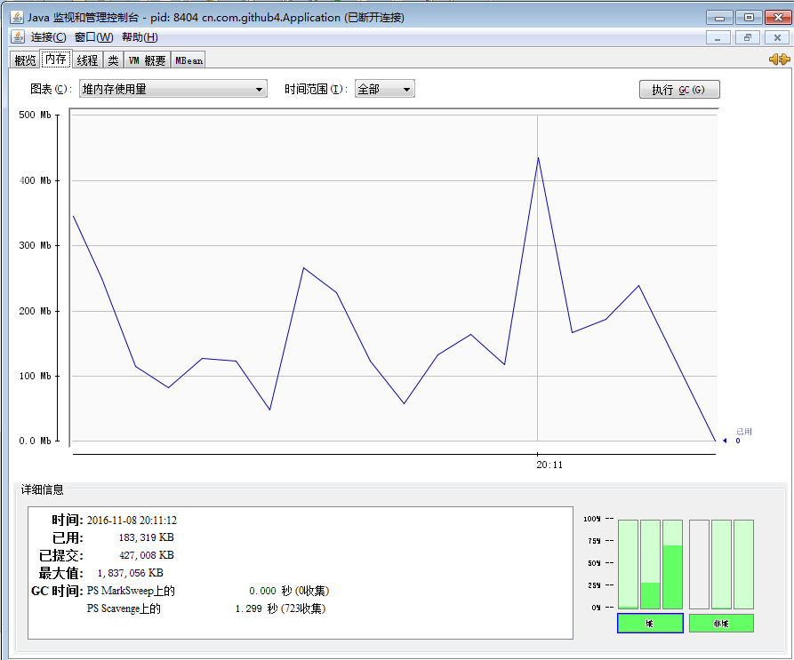

字符串是计算机程序中设计最常见的行为------来自《Thinking in java》 
---
- 我看完这一节，觉得Java圣经对字符串的描述有点啰嗦，这也是这本书让人拗口的地方，但我们去其繁琐，取其精华。
- 我认为，字符串的重点在于String，StringBuffer，StringBuilder之间特性的比较，以及它们内部的运行机制，以及结合正则表达式所产生的威力。
- 接下来，我们一 一来讲解。
#### String，StringBuffer，StringBuilder之间特性的比较
- 相同点：都是final类型，字符串的值不可以改变
- 不同点：
     1. String长度不可变，StringBuffer和StringBuilder调用append()使字符串串联起来。
     2. StringBuffer是线程安全的，StringBuilder，String线程不安全，多线程环境下，推荐StringBuffer。
#### String特性
- 初始化
```
 //直接赋值初始化
String init = "init";
//new对象并初始化，在这里会产生两个对象,"init"字符串会产生一个，New对象又会产生一个，
//这段代码的意思就是New产生的对象指向"init"字符串产生的对象
String init1 = new String("init");  
```

- String，StringBuffer，StringBuilder串联字符串时内部的运行原理

```
public class WhiterStringBuilder {
     
      //使用string
    public String implicit(String[] fields){
         String result = "";
         for(int i =0; i < fields.length;i++){
             result += fields[i];
         }
        return result;
    }
    
     //使用StringBuilder
    public String explicts(String[] fields){
        StringBuilder result = new StringBuilder();
        for (int i = 0; i < fields.length; i++) {
            result.append(fields[i]);
        }
        return result.toString();
    }
    
     //使用StringBuffer
        public String erplicts(String[] fields){
            StringBuffer result = new StringBuffer();
            for (int i = 0; i < fields.length; i++) {
                result.append(fields[i]);
            }
            return result.toString();
        }
    
}  
```
a. 在console里运行命令: ```javap -c WhiterStringBuilder```得到下面这段反编译的代码。
b.javap反编译的代码
```
▒▒▒▒: ▒▒▒▒▒▒▒ļ▒WhiterStringBuilder▒▒▒▒cn.com.github4.WhiterStringBuilder
Compiled from "WhiterStringBuilder.java"
public class cn.com.github4.WhiterStringBuilder {
  public cn.com.github4.WhiterStringBuilder();
    Code:
       0: aload_0
       1: invokespecial #8                  // Method java/lang/Object."<init>":()V
       4: return
  public java.lang.String implicit(java.lang.String[]);
    Code:
       0: ldc           #16                 // String
       2: astore_2
       3: iconst_0
       4: istore_3
       5: goto          32
       8: new           #18                 // class java/lang/StringBuilder
      11: dup
      12: aload_2
      13: invokestatic  #20                 // Method java/lang/String.valueOf:(Ljava/lang/Object;)Ljava/lang/String;
      16: invokespecial #26                 // Method java/lang/StringBuilder."<init>":(Ljava/lang/String;)V
      19: aload_1
      20: iload_3
      21: aaload
      22: invokevirtual #29                 // Method java/lang/StringBuilder.append:(Ljava/lang/String;)Ljava/lang/StringBuilder;
      25: invokevirtual #33                 // Method java/lang/StringBuilder.toString:()Ljava/lang/String;
      28: astore_2
      29: iinc          3, 1
      32: iload_3
      33: aload_1
      34: arraylength
      35: if_icmplt     8
      38: aload_2
      39: areturn
  public java.lang.String explicts(java.lang.String[]);
    Code:
       0: new           #18                 // class java/lang/StringBuilder
       3: dup
       4: invokespecial #45                 // Method java/lang/StringBuilder."<init>":()V
       7: astore_2
       8: iconst_0
       9: istore_3
      10: goto          24
      13: aload_2
      14: aload_1
      15: iload_3
      16: aaload
      17: invokevirtual #29                 // Method java/lang/StringBuilder.append:(Ljava/lang/String;)Ljava/lang/StringBuilder;
      20: pop
      21: iinc          3, 1
      24: iload_3
      25: aload_1
      26: arraylength
      27: if_icmplt     13
      30: aload_2
      31: invokevirtual #33                 // Method java/lang/StringBuilder.toString:()Ljava/lang/String;
      34: areturn
  public java.lang.String erplicts(java.lang.String[]);
    Code:
       0: new           #48                 // class java/lang/StringBuffer
       3: dup
       4: invokespecial #50                 // Method java/lang/StringBuffer."<init>":()V
       7: astore_2
       8: iconst_0
       9: istore_3
      10: goto          24
      13: aload_2
      14: aload_1
      15: iload_3
      16: aaload
      17: invokevirtual #51                 // Method java/lang/StringBuffer.append:(Ljava/lang/String;)Ljava/lang/StringBuffer;
      20: pop
      21: iinc          3, 1
      24: iload_3
      25: aload_1
      26: arraylength
      27: if_icmplt     13
      30: aload_2
      31: invokevirtual #54                 // Method java/lang/StringBuffer.toString:()Ljava/lang/String;
      34: areturn
}
```
1.   可以看到很明显的看到，String串联字符串时，先是创建了StringBuilder对象，接着调用String.valueOf得到String对象的内容，实例化这个StringBuilder对象，
接着调用append()不停的串联字符串，最后再调用StringBuilder.toString()方法返回一个新的String字符串，原来的String对象指向这个新的String字符串。
2. 而StringBuilder对象串联字符串的时候，和String关键步骤一模一样。同样是New一个对象，使用append()方法，再调用toString()返回一个字符串。
3. StringBuffer串联字符串和StringBuilder原理一样。
4. 这说明String串联字符串时，内部使用的是StringBuilder来进行工作的，而为什么我们还是频繁的使用String呢，因为直接赋值就得到一个String对象太方便了。
## 3.String，StringBuffer，StringBuilder串联字符串时效率分析

```
public class Application {
    private final int LOOP_TIMES = 30000;
    private final String CONSTANT_STRING = "min-snail";
    
    public static void main(String[] args) {
        
        new Application().startup();
    }
    
    public void testString(){
        String string = "";
        long beginTime = System.currentTimeMillis();
        for(int i = 0; i < LOOP_TIMES; i++){
            string += CONSTANT_STRING;
        }
        long endTime = System.currentTimeMillis();
        System.out.print("String : " + (endTime - beginTime) + "\t");
    }
    
    public void testStringBuffer(){
        StringBuffer buffer = new StringBuffer();
        long beginTime = System.currentTimeMillis();
        for(int i = 0; i < LOOP_TIMES; i++){
            buffer.append(CONSTANT_STRING);
        }
        buffer.toString();
        long endTime = System.currentTimeMillis();
        System.out.print("StringBuffer : " + (endTime - beginTime) + "\t");
    }
    
    public void testStringBuilder(){
        StringBuilder builder = new StringBuilder();
        long beginTime = System.currentTimeMillis();
        for(int i = 0; i < LOOP_TIMES; i++){
            builder.append(CONSTANT_STRING);
        }
        builder.toString();
        long endTime = System.currentTimeMillis();
        System.out.print("StringBuilder : " + (endTime - beginTime) + "\t");
    }
    
    public void startup(){
        for(int i = 0; i < 6; i++){
            System.out.print("The " + i + " [\t    ");
            testString();
            testStringBuffer();
            testStringBuilder();
            System.out.println("]");
        }
    }
}  
```
##### 结果:

```
The 0 [        String : 3793    StringBuffer : 2    StringBuilder : 1    ]
The 1 [        String : 3818    StringBuffer : 2    StringBuilder : 1    ]
The 2 [        String : 3859    StringBuffer : 1    StringBuilder : 1    ]
The 3 [        String : 3682    StringBuffer : 1    StringBuilder : 0    ]
The 4 [        String : 3717    StringBuffer : 1    StringBuilder : 1    ]
The 5 [        String : 3756    StringBuffer : 1    StringBuilder : 0    ]  
```
可以看到，在大规模数据串联效率方面，String的低效是惊人的，所以我们在串联字符串时，单线程时，直接给String指定初始化容量，否则就用StringBuilder,多线程情况下，我们用StringBuffer 即可。至于原因，是因为String会调用System.arrayCopy()这个方法，不停的复制数据产生新的对象，同时不停的回收对象，这样会给GC造成很大的负担。
 我们把循环开到20，执行```jconsole```,找到进行的行程，会发现负载惊人.(8G的内存)，最高峰就是String所占用的内存。
 
参考
---
- [Java圣经----Thinking in java](https://drive.google.com/file/d/0B08x0G4MmnBjYTJhYmEwMGEtMmY2ZS00ZjY3LWE2OGYtYzAxOTM2MTkyYjJi/view?ddrp=1&hl=zh_CN#):Google DOC需要翻墙
- [小牛漫谈String](http://www.cnblogs.com/fancydeepin/archive/2013/04/22/min-snail-speak_String.html)
- [小牛漫谈String，StringBuffer，StringBuilder](http://www.cnblogs.com/fancydeepin/archive/2013/04/23/min-snail-speak_String-StringBuffer-StringBuilder.html)