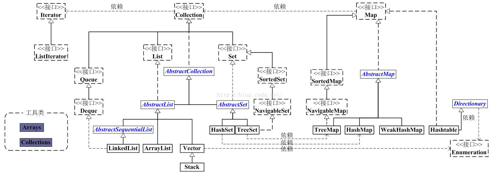

## 总体介绍
Java集合框架是Java提供的工具包，在java.util.*中，这个包中包含了常用的数据结构：集合、数组、链表、栈、队列、映射等。
我们分析下面这张图：

再结合CSDN博客李春春的文章分析：

Java集合框架构建思想是不断向上抽取共有特性，形成接口，最后形成了集合体系，我们参考的原则是***参阅顶层内容，建立底层对象***。
可以看到，Java容器对不同的集合，会先定义一个接口，再定义一个抽象类，到下面一层又是如此，使得整个框架的耦合性在合理的位置。这就是这群专家们的高明之处。
Java集合按照第一个图主要分为三部分：
1. Collection部分(非映射关系，代表单元素的序列结构)：
- List(列表)：有序可重复的线性序列，主要有数组形式ArrayList和双链表形式的LinkedList，其他的实现类不常用了。
- Set(集合)：这是一种混乱的元素不重复的数据结构，不保证元素的存放顺序，内部由Map实现，所以我们可以看到Map的集合结构和Set的集合结构非常类似，基本上了解Map就大概清楚Set的内部原理了。
- Queue(队列)：很多书籍和文章只是一笔带过，包括《Java编程思想》，我们的关注点在Deque接口和ArrayDeque实现类上，包括LinkedList也是同时实现了List和Deque，具有线性序列的特性，也有链表的特性。
2. Map部分(映射关系，代表双元素的映射结构)
- 是一种键值对的映射，使用了hash算法，理论上操作数据非常快，时间复杂度为N，是一种十分高效的数据结构，但hash碰撞会限制它的性能。
3. 工具类部分：
- 包括Iterator，Collections，Arrays等等。  
## 参考
- Java编程思想
-  AlienStar：[Java集合总览](http://blog.csdn.net/crave_shy/article/details/17416791)
-  中科春哥：[JavaSE实战----API(中)集合框架](http://blog.csdn.net/zhongkelee/article/details/46801449)
-  shy丶girl ：[java集合框架总体一览](https://yq.aliyun.com/articles/52699)
-  JR's  Blog： [Java容器源码分析之Deque与ArrayDeque](http://blog.jrwang.me/2016/java-collections-deque-arraydeque/)