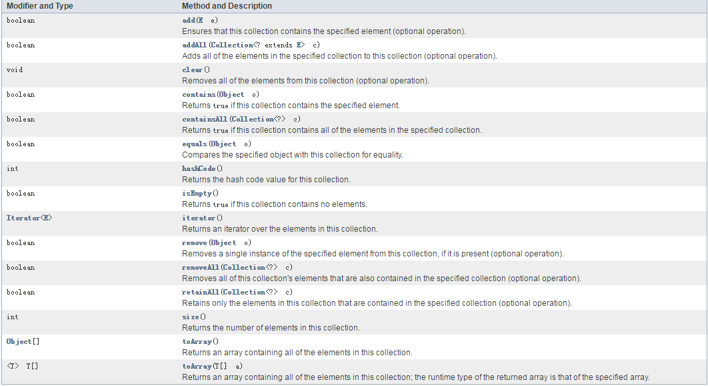
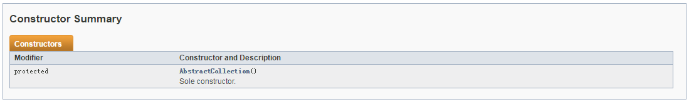
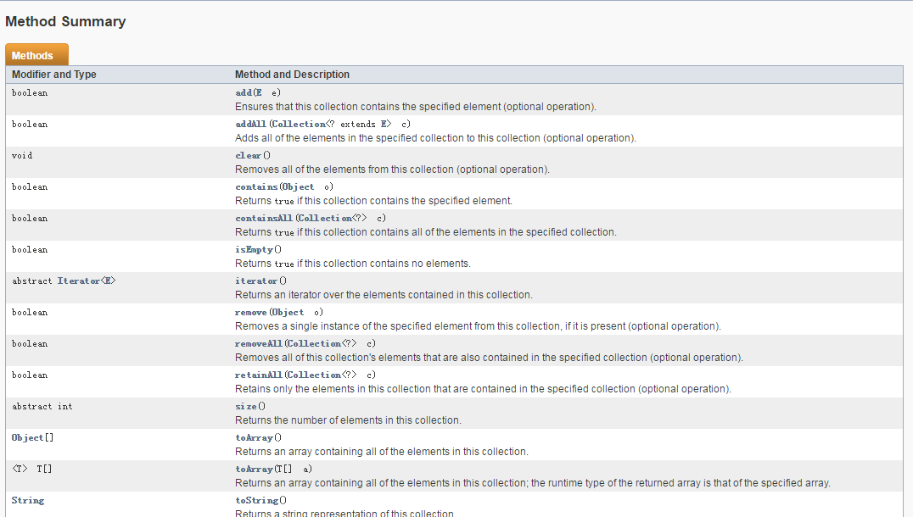
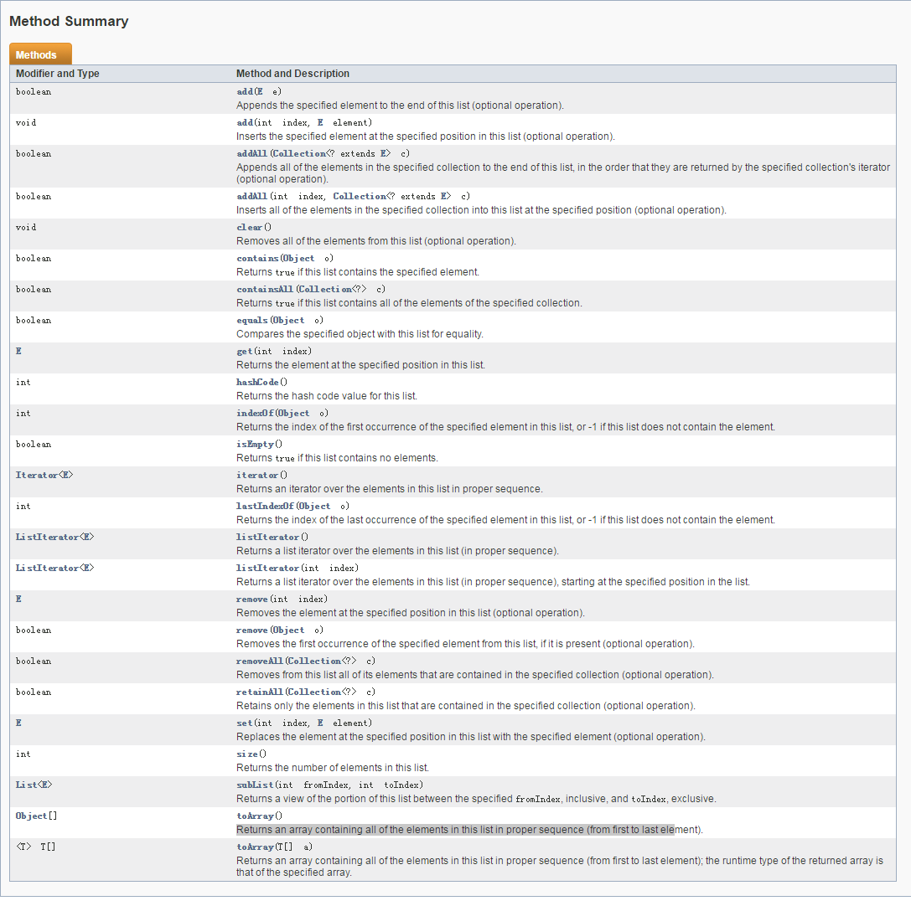

## 引言
由前一篇的文章，大家大概可以看到Java集合框架的基本结构和重点，可以这么说Java集合的重心就在List，Set，Map，Queue还有Iterator(迭代器)上。我写这篇文章主要借鉴了李春春的博客和AlienStar的专栏，以及chenssy的博客。因为《Java编程思想》说的太散了，在没法去深入了解更多的情况下，只能去高手的文章中吸取精华。
## Collection
这部分主要分两部分，Collection接口和抽象类AbstractCollection
- Collection接口
```
//继承Iterable接口，拥有迭代数据的特性
public interface Collection<E> extends Iterable<E> {}
```
再看我们接口中的主要方法

1. 添加
```
//增加单个元素
boolean add(E e);
//增加整个集合
boolean addAll(Collection<? extends E> c);
```
2. 删除
```
//删除单个元素
boolean remove(Object o);
//删除整个集合
boolean removeAll(Collection<?> c);
```
3. 判断
```
//是否包含单个元素
boolean contains(Object o);
//是否包含真个集合
boolean containsAll(Collection<?> c);
//是否相同，比较值和内容
boolean equals(Object o);
//是否为空
boolean isEmpty();
//是否有交集
boolean retainAll(Collection<?> c);
```
4. 转化数组
```
//object类型转化为数组
Object[] toArray();
//泛型转化为数组
<T> T[] toArray(T[] a);
```
5. 迭代器
```
//迭代器
Iterator<E> iterator();
```
6. 其他特性
```
//返回集合大小
int size();
//返回hashcode
int hashCode();
//清空集合
void clear();
```
可以看到此接口有判断，增加，删除，取交集，获取长度，将集合封装为数组，迭代元素的作用，这意味着所有后面的子接口和抽象类以及实现类都会拥有这些特性。
- 抽象类AbstractCollection
```
//实现Collection接口所定义的功能
public abstract class AbstractCollection<E> implements Collection<E> {}
```
1. 构造器

2. 方法

可以看到，就增加了一个```toString()```方法，其他部分都是实现Collection接口的方法，这样最大限度的减少了后面子类的重复书写。
## List
这里我摘取了chenssy对List部分所绘的图，看这张图，我们就能知道List部分基本的结构，对比API文档，我们的重点在List接口，AbstractList抽象类，ListIterator迭代器，ArrayList，LinkedList和四个实现类的比较上，知道这些，我们就把重点一一来解读。
首先要知道的一点，List就是有顺序的列表，简称序列。不管哪一种实现方式，始终离不开序列这两个字眼，应该明白ArrayList是数组实现的序列，LinkedList是链表实现的序列，Vector是数组实现的序列，Stack是栈实现的序列。序列多态性的表现就在这里。
- List接口
  List底部是由数组来存储实际数据，所以引入了索引，在list接口的方法中自然有了对索引的操作。
1. 方法
 
2. 增加
 ```
//增加单个元素
boolean add(E e);
//增加整个集合
boolean addAll(Collection<? extends E> c);
//增加整个集合
boolean addAll(int index, Collection<? extends E> c);
//增加单个元素
void add(int index, E element);
 ```
 3. 删除
```
//删除单个元素
boolean remove(E e);
//删除整个元素
boolean removeAll(Collection<? extends E> c);
//删除整个元素
boolean removeAll(int index, Collection<? extends E> c);
//删除单个元素
void remove(int index, E element);
```
4. 判断
```
//是否包含单个元素
boolean contains(Object o);
//是否包含真个集合
boolean containsAll(Collection<?> c);
//是否相同，比较值和内容
boolean equals(Object o);
//是否为空
boolean isEmpty();
//是否有交集
boolean retainAll(Collection<?> c);
```
5. 和索引相关
```
//按照索引快速访问取值
E get(int index);
//按照索引快速访问更新值
E set(int index, E element);
//从头到尾第一次出现的索引值
int indexOf(Object o);
//从尾到头第一次出现的索引值
int lastIndexOf(Object o);
//按照索引截取list上的一部分数据
List<E> subList(int fromIndex, int toIndex);
```
6. 迭代器
```
//迭代器
Iterator<E> iterator();
//list特有的迭代器
ListIterator<E> listIterator();
//按照索引值开始迭代
ListIterator<E> listIterator(int index);
```
7. 其他特性
```
//返回集合大小
int size();
//返回hashcode
int hashCode();
//清空集合
void clear();
```
由图片可以看到，拓展了很多东西，不管是add方法，remove方法，还是Iterator，都有了属于自己独有的部分，在取值和更新值上还有get和set方法，这一切都是根据序列和索引的特性来安排的。
- AbstractList抽象类
```
public abstract class AbstractList<E> extends AbstractCollection<E> implements List<E> {}
```
具体的不去说了，这一部分就是实现list接口中的方法，最大限度的让实现类共用公共的代码。
- ArrayList
首先要说的，ArrayList是我们最常用的集合类，非常便于快速访问和修改集合中的元素。为何会有这样的特性，看完这部分，你就明白了。