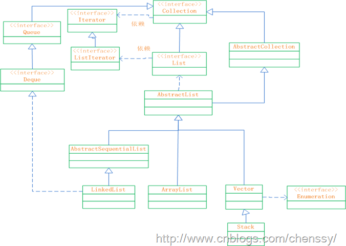

## 引言
由前一篇的文章，大家大概可以看到Java集合框架的基本结构和重点，可以这么说Java集合的重心就在List，Set，Map，Queue还有Iterator(迭代器)上。我写这篇文章主要借鉴了李春春的博客和AlienStar的专栏，因为《Java编程思想》说的太散了，在没法去深入了解更多的情况下，只能去高手的文章中吸取精华。
## Collection接口解读
这部分主要分两部分，Collection接口和抽象类AbstractCollection
- Collection接口
```
//继承Iterable接口，拥有迭代数据的特性
public interface Collection<E> extends Iterable<E> {

     //返回集合的大小
     int size();
       
    //判断集合是否为空
    boolean isEmpty();

   //判断集合是否有该数据
    boolean contains(Object o);
 
   //迭代器
    Iterator<E> iterator();

   //转为Object数组
    Object[] toArray();
 
  //转为泛型数组(这是形参)
    <T> T[] toArray(T[] a);
 
   //增加元素
    boolean add(E e);

    //将Collection元素全部添加
    boolean addAll(Collection<? extends E> c);
 
   //删除
    boolean remove(Object o);
 
   //删除所有
    boolean removeAll(Collection<?> c);
  
  //是否包含所有
    boolean containsAll(Collection<?> c);
   
 //是否删除成功
    default boolean removeIf(Predicate<? super E> filter) {
        Objects.requireNonNull(filter);
        boolean removed = false;
        final Iterator<E> each = iterator();
        while (each.hasNext()) {
            if (filter.test(each.next())) {
                each.remove();
                removed = true;
            }
        }
        return removed;
    }

    //是否含有交集
    boolean retainAll(Collection<?> c);

   //清除
    void clear();

    //数据是否一致
    boolean equals(Object o);

   //hash码
    int hashCode();
   
    @Override
    default Spliterator<E> spliterator() {
        return Spliterators.spliterator(this, 0);
    }

    default Stream<E> stream() {
        return StreamSupport.stream(spliterator(), false);
    }

    default Stream<E> parallelStream() {
        return StreamSupport.stream(spliterator(), true);
    }
}

```
可以看到此接口有判断，增加，删除，取交集，获取长度，将集合封装为数组的能力，所有后面的子接口和抽象类以及实现类都会拥有这些特性。
- 抽象类AbstractCollection
```
//实现Collection接口所定义的功能
public abstract class AbstractCollection<E> implements Collection<E> {
    //空的构造器
    protected AbstractCollection() {
    }
    //抽象的迭代器
    public abstract Iterator<E> iterator();
    //抽象的获取集合大小
    public abstract int size();
    //判断集合是否为空
    public boolean isEmpty() {
        return size() == 0;
    }
    //是否包含，先判空比较，再判非空比较，内部使用迭代器来移动元素
    public boolean contains(Object o) {
        Iterator<E> it = iterator();
        if (o==null) {
            while (it.hasNext())
                if (it.next()==null)
                    return true;
        } else {
            while (it.hasNext())
                if (o.equals(it.next()))
                    return true;
        }
        return false;
    }
   //将元素集合转化为数组
    public Object[] toArray() {
        // Estimate size of array; be prepared to see more or fewer elements
        Object[] r = new Object[size()];
        Iterator<E> it = iterator();
        for (int i = 0; i < r.length; i++) {
            if (! it.hasNext()) // fewer elements than expected
                return Arrays.copyOf(r, i);
            r[i] = it.next();
        }
        return it.hasNext() ? finishToArray(r, it) : r;
    }
    //将泛型元素集合转化为数组(形参)
    @SuppressWarnings("unchecked")
    public <T> T[] toArray(T[] a) {
        // Estimate size of array; be prepared to see more or fewer elements
        int size = size();
        T[] r = a.length >= size ? a :
                  (T[])java.lang.reflect.Array
                  .newInstance(a.getClass().getComponentType(), size);
        Iterator<E> it = iterator();
        for (int i = 0; i < r.length; i++) {
            if (! it.hasNext()) { // fewer elements than expected
                if (a == r) {
                    r[i] = null; // null-terminate
                } else if (a.length < i) {
                    return Arrays.copyOf(r, i);
                } else {
                    System.arraycopy(r, 0, a, 0, i);
                    if (a.length > i) {
                        a[i] = null;
                    }
                }
                return a;
            }
            r[i] = (T)it.next();
        }
        // more elements than expected
        return it.hasNext() ? finishToArray(r, it) : r;
    }
    //规定最大数组容量大小，防止内存泄漏
    private static final int MAX_ARRAY_SIZE = Integer.MAX_VALUE - 8;
    //私有的数组化辅助方法
    @SuppressWarnings("unchecked")
    private static <T> T[] finishToArray(T[] r, Iterator<?> it) {
        int i = r.length;
        while (it.hasNext()) {
            int cap = r.length;
            if (i == cap) {
                int newCap = cap + (cap >> 1) + 1;
                // overflow-conscious code
                if (newCap - MAX_ARRAY_SIZE > 0)
                    newCap = hugeCapacity(cap + 1);
                r = Arrays.copyOf(r, newCap);
            }
            r[i++] = (T)it.next();
        }
        // trim if overallocated
        return (i == r.length) ? r : Arrays.copyOf(r, i);
    }
     //返回最大容量值
    private static int hugeCapacity(int minCapacity) {
        if (minCapacity < 0) // overflow
            throw new OutOfMemoryError
                ("Required array size too large");
        return (minCapacity > MAX_ARRAY_SIZE) ?
            Integer.MAX_VALUE :
            MAX_ARRAY_SIZE;
    }
    //增加方法，定义了抛出的异常方法
    public boolean add(E e) {
        throw new UnsupportedOperationException();
    }
    //删除方法，先判空，再一步步删除数据，内部同样是使用了迭代器
    public boolean remove(Object o) {
        Iterator<E> it = iterator();
        if (o==null) {
            while (it.hasNext()) {
                if (it.next()==null) {
                    it.remove();
                    return true;
                }
            }
        } else {
            while (it.hasNext()) {
                if (o.equals(it.next())) {
                    it.remove();
                    return true;
                }
            }
        }
        return false;
    }
    //内部调用contains()
    public boolean containsAll(Collection<?> c) {
        for (Object e : c)
            if (!contains(e))
                return false;
        return true;
    }
    //添加所有元素，内部调用add()
    public boolean addAll(Collection<? extends E> c) {
        boolean modified = false;
        for (E e : c)
            if (add(e))
                modified = true;
        return modified;
    }
    //删除所有元素，内部调用remove(),使用了迭代器
    public boolean removeAll(Collection<?> c) {
        Objects.requireNonNull(c);
        boolean modified = false;
        Iterator<?> it = iterator();
        while (it.hasNext()) {
            if (c.contains(it.next())) {
                it.remove();
                modified = true;
            }
        }
        return modified;
    }
     //取交集，先迭代，在判断是否包含
    public boolean retainAll(Collection<?> c) {
        Objects.requireNonNull(c);
        boolean modified = false;
        Iterator<E> it = iterator();
        while (it.hasNext()) {
            if (!c.contains(it.next())) {
                it.remove();
                modified = true;
            }
        }
        return modified;
    }
    //清除
    public void clear() {
        Iterator<E> it = iterator();
        while (it.hasNext()) {
            it.next();
            it.remove();
        }
    }
    //返回字符串形式
    public String toString() {
        Iterator<E> it = iterator();
        if (! it.hasNext())
            return "[]";
        StringBuilder sb = new StringBuilder();
        sb.append('[');
        for (;;) {
            E e = it.next();
            sb.append(e == this ? "(this Collection)" : e);
            if (! it.hasNext())
                return sb.append(']').toString();
            sb.append(',').append(' ');
        }
    }
}
```
可以看到抽象类``AbstractCollection()```是对Collection接口的轻量级实现，实现了大部分基础的接口方法，里面很多地方用到了数组，所以说数组是容器的集合的基础。
## List解读
如前面所说，List集合是一个有序可重复值的列表，通过索引来访问基本数据类型或者保存对象的引用地址，我们来看下这个接口在Collection上又增加了那些特性。
- List总体结构图

- List接口
```
//继承Collection接口，拥有Collection接口的所有特性
public interface List<E> extends Collection<E> {
    //得到size()
    int size();
    //判断是否为空
    boolean isEmpty();
    //判断是否包含
    boolean contains(Object o);
    //转化为数组
    <T> T[] toArray(T[] a);
    //增加元素
    boolean add(E e);
    //删除
    boolean remove(Object o);
    //是否全部包含
    boolean containsAll(Collection<?> c);
    //添加全部
    boolean addAll(Collection<? extends E> c);
    //从某一处插入全部数据
    boolean addAll(int index, Collection<? extends E> c);
    //删除全部数据
    boolean removeAll(Collection<?> c);
    //是否有交集
    boolean retainAll(Collection<?> c);
    //覆盖全部
    default void replaceAll(UnaryOperator<E> operator) {
        Objects.requireNonNull(operator);
        final ListIterator<E> li = this.listIterator();
        while (li.hasNext()) {
            li.set(operator.apply(li.next()));
        }
    }
    //排序，使用了Comparetor，引用了Arrays.sort(),这是个二分排序
    @SuppressWarnings({"unchecked", "rawtypes"})
    default void sort(Comparator<? super E> c) {
        Object[] a = this.toArray();
        Arrays.sort(a, (Comparator) c);
        ListIterator<E> i = this.listIterator();
        for (Object e : a) {
            i.next();
            i.set((E) e);
        }
    }
    //清除
    void clear();
    //判断类型和值是否相等
    boolean equals(Object o);
    //hash值
    int hashCode();
    //按照索引来取值
    E get(int index);
    //按照索引更新值
    E set(int index, E element);
    //增加
    void add(int index, E element);
    //删除
    E remove(int index);
    //元素从开头第一次出现的位置
    int indexOf(Object o);
    //元素从结尾开始第一次出现的位置
    int lastIndexOf(Object o);
    //专门为List设计的迭代器
    ListIterator<E> listIterator();
    //从索引处开始迭代
    ListIterator<E> listIterator(int index);
    //截取，从某处开始，到另一处结束
    List<E> subList(int fromIndex, int toIndex);
    
    @Override
    default Spliterator<E> spliterator() {
        return Spliterators.spliterator(this, Spliterator.ORDERED);
    }
}  
```
通过源码可以看到，由于List使用了索引，所以专门有针对索引的方法，```get()```，```set()```，```indexOf()```，```lastIndexOf()```。另外还有一个专门用来迭代List容器的方法```listIterator()```。在这一层，```List```容器就比单独的```Collection```又复杂了一些。
- 抽象的AbstractCollection类,不具体去写了
```
 //继承AbstractCollection类，实现List接口
public abstract class AbstractList<E> extends AbstractCollection<E> implements List<E> {  
       
 }
```